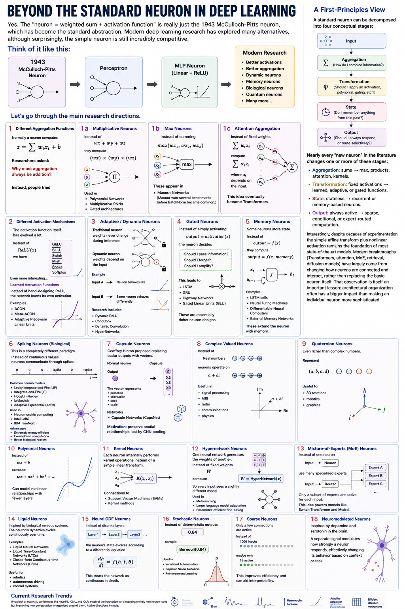

# Beyond the Standard Neuron in Deep Learning


Yes. The "neuron = weighted sum + activation function" is really just the **1943 McCulloch-Pitts neuron**, which has become the standard abstraction. Modern deep learning research has explored many alternatives, although surprisingly, the simple neuron is still incredibly competitive.

Think of it like this:

```text
1943
McCulloch-Pitts Neuron
        ↓
Perceptron
        ↓
MLP Neuron (Linear + ReLU)
        ↓
Modern Research
 ├── Better activations
 ├── Better aggregation
 ├── Dynamic neurons
 ├── Memory neurons
 ├── Biological neurons
 ├── Quantum neurons
 └── Many more...
```

Let's go through the main research directions.

---

# 1. Different Aggregation Functions

Normally a neuron computes

\[
z = \sum_i w_i x_i + b
\]

Researchers asked:

> Why must aggregation always be addition?

Instead, people tried

### Multiplicative neurons

Instead of

```text
wx + wy + wz
```

they compute

```text
(wx) × (wy) × (wz)
```

These naturally model interactions.

Used in

- Polynomial Networks
- Multiplicative RNNs
- Gated architectures

---

### Max Neurons

Instead of summing

```text
max(wx1, wx2, wx3)
```

These appear in

- Maxout Networks

(Maxout won several benchmarks before BatchNorm became common.)

---

### Attention Aggregation

Instead of fixed weights

```text
Σ wi xi
```

compute

```text
Σ αi xi
```

where

```text
αi
```

depends on the input.

This idea eventually became Transformers.

---

# 2. Different Activation Mechanisms

The activation function itself has evolved a lot.

Instead of

```text
ReLU(x)
```

we have

```text
GELU
SiLU
Swish
Mish
Snake
Softplus
```

Even more interesting...

### Learned Activation Functions

Instead of hand-designing

```text
ReLU
```

the network learns its own activation.

Examples

- ACON
- Meta-ACON
- Adaptive Piecewise Linear Units

---

# 3. Adaptive / Dynamic Neurons

Traditional neuron

```text
weights never change during inference
```

Dynamic neuron

```text
weights depend on the input
```

Example

```text
Input A

Neuron behaves like

ReLU

Input B

Same neuron behaves differently
```

Research includes

- Dynamic ReLU
- CondConv
- Dynamic Convolution
- HyperNetworks

---

# 4. Gated Neurons

Instead of simply activating

```text
output = activation(z)
```

the neuron decides

```text
Should I pass information?
Should I forget?
Should I amplify?
```

This leads to

- LSTM
- GRU
- Highway Networks
- Gated Linear Units (GLU)

These are essentially richer neuron designs.

---

# 5. Memory Neurons

Some neurons store state.

Instead of

```text
output = f(x)
```

they compute

```text
output = f(x, memory)
```

Examples

- LSTM cells
- Neural Turing Machines
- Differentiable Neural Computers
- External Memory Networks

These extend the neuron with memory.

---

# 6. Spiking Neurons (Biological)

This is a completely different paradigm.

Instead of

```text
continuous values
```

neurons communicate through spikes.

```text
0

0

0

1 spike

0

1 spike
```

Common neuron models

- Leaky Integrate-and-Fire (LIF)
- Integrate-and-Fire (IF)
- Hodgkin-Huxley
- Izhikevich
- Adaptive Exponential (AdEx)

Used in

- Neuromorphic computing
- Intel Loihi
- IBM TrueNorth

Advantages

- Extremely energy efficient
- Event-driven computation
- Better biological realism

---

# 7. Capsule Neurons

Geoffrey Hinton proposed replacing scalar outputs with vectors.

Normal neuron

```text
Output

0.83
```

Capsule

```text
[0.8
 0.2
 0.5
 0.9
 ...]
```

The vector represents

- presence
- orientation
- pose
- scale

Networks

- Capsule Networks (CapsNet)

Motivation: preserve spatial relationships lost by CNN pooling.

---

# 8. Complex-Valued Neurons

Instead of

```text
Real numbers
```

neurons operate on

```text
a + bi
```

Useful in

- signal processing
- MRI
- radar
- communications
- physics

---

# 9. Quaternion Neurons

Even richer than complex numbers.

Represent

```text
(a,b,c,d)
```

Useful for

- 3D rotations
- robotics
- graphics

---

# 10. Polynomial Neurons

Instead of

```text
wx+b
```

compute

```text
wx
+ ax²
+ bx³
+ ...
```

Can model nonlinear relationships with fewer layers.

---

# 11. Kernel Neurons

Each neuron internally performs kernel operations instead of a simple linear transform.

Connections to

- Support Vector Machines (SVMs)
- Kernel methods

---

# 12. Hypernetwork Neurons

One neural network generates the weights of another.

Instead of fixed weights

```text
W
```

compute

```text
W = HyperNetwork(x)
```

So every input sees a slightly different model.

Used in

- Meta-learning
- Large language model adaptation
- Parameter-efficient fine-tuning

---

# 13. Mixture-of-Experts (MoE) Neurons

Instead of one neuron

```text
Input
  ↓
Neuron
```

use many specialized experts

```text
          Expert A
Input → Router → Expert B
          Expert C
```

Only a subset of experts are active for each input.

This idea powers models like Switch Transformer and Mixtral.

---

# 14. Liquid Neurons

Inspired by biological nervous systems.

The neuron's dynamics evolve continuously over time.

Examples

- Liquid Neural Networks
- Liquid Time-Constant Networks (LTCs)
- Closed-form Continuous-time Networks (CfCs)

Useful for

- robotics
- autonomous driving
- control systems

---

# 15. Neural ODE Neurons

Instead of discrete layers

```text
Layer1

Layer2

Layer3
```

the neuron's state evolves according to a differential equation

\[
\frac{dh}{dt}=f(h,t,\theta)
\]

This treats the network as continuous in depth.

---

# 16. Stochastic Neurons

Instead of deterministic outputs

```text
0.84
```

sample

```text
Bernoulli(0.84)
```

Used in

- Variational Autoencoders
- Bayesian Neural Networks
- Reinforcement Learning

---

# 17. Sparse Neurons

Only a few connections are active.

Instead of

```text
1000 inputs
```

maybe only

```text
15 active
```

This improves efficiency and can aid interpretability.

---

# 18. Neuromodulated Neurons

Inspired by dopamine and serotonin in the brain.

A separate signal modulates how strongly a neuron responds, effectively changing its behavior based on context or task.

---

# Current Research Trends

If you look at major ML conferences like NeurIPS, ICML, and ICLR, much of the innovation isn't inventing entirely new neuron types but improving how computation is organized around them. Active directions include:

- Dynamic computation (input-dependent behavior)
- Sparse activation and Mixture-of-Experts
- Continuous-time neural networks
- Spiking neural networks
- Neuromorphic hardware
- Learned activation functions
- Adaptive parameter generation (HyperNetworks)
- Memory-augmented architectures
- Efficient attention mechanisms

---

# A First-Principles View

A standard neuron can be decomposed into four conceptual stages:

```text
Input
   │
   ▼
Aggregation
(How do I combine information?)
   │
   ▼
Transformation
(Should I apply an activation, polynomial, gating, etc.?)
   │
   ▼
State
(Do I remember anything from the past?)
   │
   ▼
Output
(Should I always respond, or route selectively?)
```

Nearly every "new neuron" in the literature changes one or more of these stages:

- **Aggregation:** sums → max, products, attention, kernels.
- **Transformation:** fixed activations → learned, adaptive, or gated functions.
- **State:** stateless → recurrent or memory-based neurons.
- **Output:** always active → sparse, conditional, or expert-routed computation.

Interestingly, despite decades of experimentation, the simple affine transform plus nonlinear activation remains the foundation of most state-of-the-art models. Modern breakthroughs (Transformers, attention, MoE, retrieval, diffusion models) have largely come from **changing how neurons are connected and interact**, rather than replacing the basic neuron itself. That observation is itself an important lesson: architectural organization often has a bigger impact than making an individual neuron more sophisticated.


